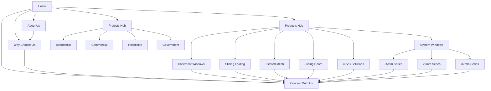

# Rachana Aluminium — Information Architecture (Phase 2)

> This document defines the page-level architecture for every page on the website.
> No UI decisions. No visual design. Structure and content logic only.

---

## Global Navigation Structure

```
[Logo]  Home   Products ▾   Projects ▾   About Us   Why Choose Us   Connect With Us
```

- **Products** dropdown reveals all 6 product categories
- **Projects** dropdown reveals 4 project types
- All other items are direct links
- Footer repeats full navigation + contact info + showroom/workshop addresses

---

## Global Elements (Present on Every Page)

### Header
- Company logo (links to Home)
- Primary navigation
- "Connect With Us" as the final nav item (soft CTA, not a button)

### Footer
1. Company name + tagline ("Quality at its Best")
2. Quick links (all main pages)
3. Product links
4. Contact information (phone, email)
5. Showroom address (Kolhapur)
6. Workshop locations (Ichalkaranji, Kabnoor)
7. Service regions summary
8. Social media links (if applicable)

### Persistent Soft CTA
- A gentle "Connect With Us" or "Discuss Your Project" prompt
- Present at the bottom of every page, before footer
- Never aggressive. Never floating. Never interrupting.

---
---

# PAGE 1 — HOME

## Purpose
The front door of the brand. It must immediately communicate professionalism, quality, and warmth. It gives visitors a complete overview of who Rachana Aluminium is, what they do, and why they can be trusted — all in a single scroll.

## Target Audience
- **Primary:** Builders, Architects, Engineers, Contractors (arriving to evaluate the company)
- **Secondary:** Homeowners (arriving to explore window/door options)

## User Goals
- Quickly understand what this company does
- Assess professionalism and credibility
- See the range of products offered
- View completed projects as proof of capability
- Find a way to connect if interested

## Business Goals
- Create a strong, lasting first impression
- Establish trust within the first 5 seconds
- Guide visitors toward Products, Projects, or Connect With Us
- Communicate brand values without stating them explicitly

## Required Sections (in content hierarchy order)

### 1. Hero Section
- **Content:** A single powerful visual (real project photography) with a short headline and sub-headline
- **Headline direction:** Calm, confident, brand-defining (not a sales pitch)
- **Sub-headline:** One sentence that positions the company
- **CTA:** "Explore Our Work" or similar (not "Get Quote")
- **Priority:** HIGHEST — this is the first thing visitors see

### 2. Trust Indicators
- **Content:** Key credibility facts displayed as compact visual elements
- **Data points:**
  - Established 2012
  - 25+ years of owner experience
  - 500+ completed projects
  - Multi-state presence
  - 50–70 team members
- **Format:** Icons or small cards — no long text
- **Priority:** HIGH — immediate proof after the hero

### 3. Our Philosophy
- **Content:** A short, honest statement about how the company approaches its work
- **Direction:** "We treat every project as if we were building it for ourselves."
- **Format:** A visually distinct section — could be a quote, could be a short 2–3 line block
- **Priority:** HIGH — establishes the human, values-driven character

### 4. Our Process
- **Content:** A simplified visual walkthrough of how a project moves from inquiry to completion
- **Steps to represent:**
  1. Consultation & Understanding Requirements
  2. Customization & Design Guidance
  3. In-House Manufacturing
  4. Quality Checks
  5. Installation
  6. After-Sales Support
- **Format:** Linear visual flow (icons + short labels)
- **Priority:** MEDIUM — builds confidence in the company's methodology

### 5. Featured Products
- **Content:** Visual cards for the main product categories
- **Products to show:** System Windows, Casement Windows, Sliding Folding Windows & Doors, Pleated Mesh, Sliding Doors, uPVC Solutions
- **Each card:** Product image + product name + one-line description + link to product page
- **Priority:** HIGH — core offering visibility

### 6. Featured Projects
- **Content:** A curated selection of completed projects (3–6 projects)
- **Each item:** Project image + project type (Residential/Commercial/etc.) + location
- **Link:** "View All Projects"
- **Priority:** HIGH — visual proof of capability

### 7. Why Choose Us (Summary)
- **Content:** Condensed version of the Why Choose Us page — 3–4 key differentiators
- **Differentiators to highlight:**
  - In-House Manufacturing (~90%)
  - Customization
  - Personal Attention
  - After-Sales Service
- **Format:** Icon cards or compact grid
- **Link:** "Learn More" → Why Choose Us page
- **Priority:** MEDIUM

### 8. Connect With Us (Soft CTA)
- **Content:** A warm, inviting section encouraging visitors to reach out
- **Language:** "Let's discuss your project" / "We'd love to hear from you"
- **Elements:** Brief text + link/button to Connect With Us page
- **Priority:** MEDIUM — closing the page on a human note

## Navigation Flow
```
Hero → Trust Indicators → Philosophy → Process → Products → Projects → Why Choose Us → Connect
                                                     ↓              ↓
                                              Product Pages    Projects Page
```

---
---

# PAGE 2 — PRODUCTS HUB

## Purpose
A central landing page for all product categories. Acts as a visual directory that helps visitors find the right product type quickly.

## Target Audience
- Architects and builders looking for specific product types
- Homeowners browsing product options

## User Goals
- See the full range of products at a glance
- Navigate to the specific product category they need
- Understand the breadth of offerings

## Business Goals
- Showcase the full product range
- Direct traffic to individual product pages
- Demonstrate versatility and completeness of solutions

## Required Sections

### 1. Page Header
- **Content:** Page title ("Our Products") + a short introductory line
- **Intro direction:** "From system windows to uPVC solutions — every product is built with precision and care."

### 2. Product Category Grid
- **Content:** Visual cards for each of the 6 product categories
- **Each card:**
  - Product category image (real photography)
  - Category name
  - One-line description (what it is, not a sales pitch)
  - Link to the category page
- **Categories:**
  1. System Windows
  2. Casement Windows
  3. Sliding Folding Windows & Doors
  4. Pleated Mesh
  5. Sliding Doors
  6. uPVC Solutions
- **Priority:** HIGHEST

### 3. Selection Guidance Teaser
- **Content:** A short note educating visitors that each product page includes a Selection Guide
- **Direction:** "Not sure which product suits your needs? Every product page includes a Selection Guide to help you decide."
- **Priority:** LOW — supportive context

### 4. Soft CTA
- **Content:** "Need help choosing? Connect with us."
- **Priority:** LOW

## Navigation Flow
```
Products Hub → [Any Product Category Page]
             → Connect With Us
```

---
---

# PAGE 3 — SYSTEM WINDOWS (Category Page)

## Purpose
The primary landing page for the System Windows product category. Introduces the product type, explains the three series (25mm, 29mm, 32mm) without positioning them as tiers, and helps visitors navigate to the right series or use the Selection Guide.

## Target Audience
- **Primary:** Architects and builders specifying windows for projects
- **Secondary:** Homeowners replacing or installing new windows

## User Goals
- Understand what System Windows are
- See the three series options and understand their differences (dimensional, not quality-based)
- Navigate to the specific series that matches their project requirements
- Access the Selection Guide for help deciding

## Business Goals
- Present System Windows as the company's core product
- Drive visitors to series-specific pages or the Selection Guide
- Establish product knowledge and credibility

## Required Sections

### 1. Hero
- **Content:** A high-quality image of a System Window installation + product category name
- **Sub-text:** One sentence describing what System Windows are
- **Priority:** HIGH

### 2. About This Product
- **Content:** A brief, clear explanation of System Windows — what they are, how they work, and why they're a popular choice
- **Tone:** Informative, calm, not sales-driven
- **Priority:** HIGH

### 3. Key Features
- **Content:** Core features shared across all three series
- **Format:** Icon + short label + one-line description
- **Examples:** Weather sealing, smooth operation, durability, elegant profiles
- **Priority:** HIGH

### 4. The Three Series — Overview
- **Content:** Visual cards for each series (25mm, 29mm, 32mm)
- **Each card:**
  - Series name (e.g., "25 mm Series")
  - A representative image
  - Brief description of profile dimension and typical application context
  - Link to the series detail page

> [!IMPORTANT]
> Do NOT use tier language (Basic/Premium/Flagship). All three are premium. Differentiation is by profile size, opening dimensions, and structural requirements.

- **Priority:** HIGHEST — the core decision point on this page

### 5. Selection Guide
- **Content:** A section helping visitors understand which series suits their needs
- **Decision factors to present:**
  - Opening size
  - Window dimensions
  - Structural requirements
  - The 32mm series handles larger openings (~10 ft+)
- **Format:** Simple comparison or guided Q&A flow — not a dense specification table
- **Tone:** Educational, helpful
- **Priority:** HIGH

### 6. Customization Options
- **Content:** Overview of how System Windows can be customized
- **Options:** Colours, Glass types, Handles, Locks, Mesh
- **Note:** Company also provides customization recommendations
- **Priority:** MEDIUM

### 7. Applications
- **Content:** Where System Windows are typically used
- **Examples:** Residential buildings, commercial projects, high-rise apartments, bungalows
- **Format:** Icons or image cards
- **Priority:** MEDIUM

### 8. Gallery
- **Content:** Curated photos of completed System Window installations
- **Priority:** MEDIUM

### 9. Related Products
- **Content:** Links to other product categories (Casement Windows, Sliding Doors, etc.)
- **Priority:** LOW

## Navigation Flow
```
System Windows → 25mm Series Page
               → 29mm Series Page
               → 32mm Series Page
               → Selection Guide (anchor or expandable section)
               → Related Products → [Other product pages]
```

---

## PAGE 3a / 3b / 3c — SYSTEM WINDOWS: SERIES DETAIL PAGES (25mm / 29mm / 32mm)

> These three pages share the same structure. Only the content differs.

### Purpose
Provide detailed information about a specific series — its profile dimensions, typical applications, features, customization options, and gallery of installations.

### Target Audience
- Architects/builders who have already narrowed down to this series
- Homeowners referred here by the Selection Guide

### User Goals
- Understand this specific series in depth
- See real installations
- Understand customization options
- Confirm this is the right fit for their project

### Business Goals
- Educate the customer thoroughly
- Build confidence in the specific product
- Encourage the next step (Connect With Us)

### Required Sections

1. **Hero** — Series name + representative image + one-line positioning (dimensional, not tier-based)
2. **About This Series** — What the profile dimension means, what makes this series suited for certain applications
3. **Key Features** — Features specific to this series
4. **Carefully Selected Components** — The materials, hardware, seals, and fittings used — positioned as quality indicators
5. **Customization Options** — Colours, Glass types, Handles, Locks, Mesh options available for this series
6. **Applications** — Typical use cases and project types
7. **Gallery** — Completed installations featuring this series
8. **Selection Guide Link** — "Not sure this is the right series? See our Selection Guide" → links back to parent category's Selection Guide
9. **Related Products** — Other System Window series + other product categories

### Navigation Flow
```
Series Page → Back to System Windows (parent)
            → Other series pages (25mm ↔ 29mm ↔ 32mm)
            → Selection Guide
            → Connect With Us
```

---
---

# PAGE 4 — CASEMENT WINDOWS

## Purpose
Dedicated page for the Casement Windows product category. Educates visitors on what casement windows are, their features, customization options, and when to choose them.

## Target Audience
- Architects specifying window types for new builds
- Homeowners looking for specific window opening styles

## User Goals
- Understand what casement windows are and how they differ from system windows
- See features and customization options
- View completed installations
- Determine if casement windows are right for their project

## Business Goals
- Showcase casement windows as a quality offering
- Help visitors make informed decisions via the Selection Guide
- Drive toward Connect With Us

## Required Sections

### 1. Hero
- Product image + category name + one-line description

### 2. About This Product
- What casement windows are, how they open, and their advantages
- Calm, informative language

### 3. Key Features
- Icon + label format
- Examples: Wide opening, ventilation, weather sealing, security, aesthetic appeal

### 4. Carefully Selected Components
- Materials, hinges, hardware, seals — quality-focused

### 5. Customization Options
- Colours, Glass types, Handles, Locks, Mesh options

### 6. Selection Guide
- When to choose casement windows vs. other window types
- Decision factors: ventilation needs, opening clearance, building design, personal preference
- Format: Educational, visual, not a spec sheet

### 7. Applications
- Where casement windows work best (residential, specific room types, architectural styles)

### 8. Gallery
- Real project photos

### 9. Related Products
- Links to other product categories

## Navigation Flow
```
Casement Windows → Selection Guide (in-page)
                 → Related Products → [Other product pages]
                 → Connect With Us
```

---
---

# PAGE 5 — SLIDING FOLDING WINDOWS & DOORS

## Purpose
Dedicated page for Sliding Folding Windows & Doors. Showcases this product as a premium, space-optimizing solution.

## Target Audience
- Architects designing open-plan or indoor-outdoor living spaces
- Premium homeowners looking for modern design elements
- Hospitality projects (resorts, restaurants)

## User Goals
- Understand how sliding folding systems work
- See real installations in similar project types
- Evaluate customization options
- Determine suitability for their project

## Business Goals
- Position this as a premium, aspirational product
- Demonstrate expertise in complex installations
- Drive inquiries for custom projects

## Required Sections

1. **Hero** — Stunning installation image + product name + one-liner
2. **About This Product** — How sliding folding systems work, their unique advantages (space, aesthetics, flexibility)
3. **Key Features** — Smooth folding operation, weather sealing, panel configurations, track systems
4. **Carefully Selected Components** — Track hardware, rollers, seals, hinges — quality emphasis
5. **Customization Options** — Colours, Glass types, Handles, Locks, panel configurations
6. **Selection Guide** — When to choose sliding folding vs. regular sliding vs. casement. Space requirements, aesthetic goals, structural considerations
7. **Applications** — Living rooms, balconies, resorts, restaurants, commercial facades
8. **Gallery** — Project photos emphasizing the dramatic visual effect
9. **Related Products**

## Navigation Flow
```
Sliding Folding → Selection Guide (in-page)
               → Related Products
               → Connect With Us
```

---
---

# PAGE 6 — PLEATED MESH

## Purpose
Dedicated page for Pleated Mesh solutions. Positions this as a complementary product that enhances window and door installations with insect protection.

## Target Audience
- Existing customers adding mesh to their windows/doors
- New customers evaluating mesh as part of a complete window solution
- Architects specifying integrated solutions

## User Goals
- Understand what pleated mesh is and how it works
- See how it integrates with different window/door types
- Evaluate if it suits their needs

## Business Goals
- Cross-sell mesh with window/door installations
- Demonstrate attention to complete solutions (not just windows)
- Show quality in every accessory, not just primary products

## Required Sections

1. **Hero** — Product image + name + one-liner
2. **About This Product** — What pleated mesh is, how it works, why it's better than traditional mesh
3. **Key Features** — Retractable design, smooth operation, durability, unobstructed views
4. **Carefully Selected Components** — Mesh material quality, track system, frame compatibility
5. **Customization Options** — Colours, mesh types, mounting configurations
6. **Selection Guide** — Which mesh option suits which window/door type. Factors: window type, opening size, usage frequency
7. **Applications** — All window and door types, residential, commercial
8. **Gallery** — Installation photos
9. **Related Products** — Links back to the window/door types it complements

## Navigation Flow
```
Pleated Mesh → Selection Guide (in-page)
             → Related Products (windows & doors it works with)
             → Connect With Us
```

---
---

# PAGE 7 — SLIDING DOORS

## Purpose
Dedicated page for Sliding Doors. Presents this as a modern, space-efficient solution for larger openings.

## Target Audience
- Architects and builders designing for large openings (balconies, patios, terraces)
- Homeowners upgrading to modern door systems

## User Goals
- Understand sliding door systems and their advantages
- See real installations
- Evaluate customization options
- Compare with sliding folding doors if needed

## Business Goals
- Showcase expertise in large-opening solutions
- Highlight in-house manufacturing capability for large panels
- Drive project inquiries

## Required Sections

1. **Hero** — Installation image + product name + one-liner
2. **About This Product** — How sliding doors work, space savings, aesthetic benefits
3. **Key Features** — Smooth sliding, weather sealing, security, handling large spans
4. **Carefully Selected Components** — Rollers, track systems, locking mechanisms, seals
5. **Customization Options** — Colours, Glass types, Handles, Locks, panel configurations
6. **Selection Guide** — When to choose sliding doors vs. sliding folding. Factors: opening width, space constraints, design preference
7. **Applications** — Balconies, terraces, living rooms, commercial entrances
8. **Gallery** — Project photos
9. **Related Products**

## Navigation Flow
```
Sliding Doors → Selection Guide (in-page)
              → Related Products (esp. Sliding Folding for comparison)
              → Connect With Us
```

---
---

# PAGE 8 — uPVC SOLUTIONS

## Purpose
Dedicated page for uPVC products. Positions uPVC as an alternative material offering with its own set of advantages.

## Target Audience
- Customers specifically looking for uPVC (often due to budget, climate, or maintenance preferences)
- Architects specifying materials for specific project types

## User Goals
- Understand what uPVC is and how it differs from aluminium
- See the range of uPVC products available
- Evaluate if uPVC is the right material choice for their project

## Business Goals
- Show that Rachana Aluminium offers complete solutions beyond aluminium
- Educate customers to help them make material-informed decisions
- Capture the uPVC segment without diminishing the aluminium brand

## Required Sections

1. **Hero** — Product image + category name + one-liner
2. **About uPVC** — What uPVC is, its material properties, and general advantages
3. **Key Features** — Thermal insulation, low maintenance, weather resistance, sound insulation
4. **Carefully Selected Components** — Profiles, hardware, reinforcements, glass options
5. **Customization Options** — Colours, Glass types, Handles, Locks
6. **Selection Guide** — When to consider uPVC vs. aluminium. Factors: climate, maintenance preferences, budget, aesthetic goals. Presented neutrally — not pushing one over the other
7. **Applications** — Residential, commercial, projects where thermal/sound insulation is a priority
8. **Gallery** — Installation photos
9. **Related Products** — Links to aluminium alternatives for comparison

## Navigation Flow
```
uPVC Solutions → Selection Guide (in-page, incl. uPVC vs Aluminium guidance)
               → Related Products
               → Connect With Us
```

---
---

# PAGE 9 — PROJECTS HUB

## Purpose
A visual portfolio page showcasing completed projects. Acts as the strongest proof-of-capability element on the entire website.

## Target Audience
- **Primary:** Architects and builders evaluating the company's track record
- **Secondary:** Homeowners seeking visual inspiration and reassurance

## User Goals
- Browse completed projects by category
- See the quality and scale of past work
- Find projects similar to their own (by type or location)
- Gain confidence in the company's abilities

## Business Goals
- Provide undeniable visual proof of quality and experience
- Showcase range (residential to government projects)
- Build trust through real work, not marketing claims

## Required Sections

### 1. Page Header
- Title ("Our Projects") + short intro
- Intro direction: "Over 500 projects completed across multiple states."

### 2. Category Filter / Navigation
- Allow visitors to filter or navigate by project type:
  - All Projects
  - Residential
  - Commercial
  - Hospitality
  - Government & Institutional
- **Priority:** HIGH

### 3. Project Grid
- Visual grid/masonry of project thumbnails
- Each project card:
  - Project image (primary)
  - Project type label
  - Location
  - Link to project detail (if individual project pages exist) or larger gallery view
- **Priority:** HIGHEST

### 4. Soft CTA
- "Have a similar project in mind? Let's discuss."
- **Priority:** LOW

## Navigation Flow
```
Projects Hub → Filter by Category (Residential / Commercial / Hospitality / Gov)
             → Individual Project Detail (if applicable)
             → Connect With Us
```

---

## PAGE 9a / 9b / 9c / 9d — PROJECT CATEGORY PAGES

> Residential / Commercial / Hospitality / Government & Institutional

### Purpose
Filtered views of the projects portfolio by category. May be implemented as filtered states of the Projects Hub or as separate pages.

### Target Audience
- Visitors looking for projects matching their own project type

### User Goals
- See projects relevant to their category
- Evaluate the company's experience in their specific sector

### Business Goals
- Demonstrate depth of experience per sector
- Build sector-specific credibility

### Required Sections

1. **Category Header** — Category name + brief description of the company's work in this sector
2. **Project Grid** — Filtered to this category only
3. **Cross-Category Navigation** — Easy access to other project categories
4. **Soft CTA** — "Working on a [category] project? Connect with us."

### Navigation Flow
```
Category Page → Other Categories
              → Projects Hub (all)
              → Connect With Us
```

---
---

# PAGE 10 — ABOUT US

## Purpose
The soul of the website. This page tells the human story of Rachana Aluminium — who they are, what they believe, and why they do what they do. It must be the most emotionally resonant page on the site.

## Target Audience
- Anyone evaluating the company at a deeper level (builders, architects, homeowners)
- Visitors who want to understand the people behind the products

## User Goals
- Learn the company's story and history
- Understand the people and values behind the brand
- See the infrastructure (workshops, showroom)
- Assess the company's geographic reach

## Business Goals
- Build deep trust and emotional connection
- Communicate values without being preachy
- Show the human side — workers, owner, culture
- Demonstrate scale and infrastructure

## Required Sections

### 1. Our Story
- **Content:** The company's origin, the owner's journey, how it grew from experience to enterprise
- **Tone:** First-person plural ("We started with…"), honest, humble, warm
- **Key facts:** Established 2012, 25+ years of owner experience, growth story
- **Priority:** HIGH

### 2. Quality Products. Trusted Relationships.
- **Content:** A section that bridges the product quality with the relationship philosophy
- **Direction:** Not a mission statement — more of a lived truth
- **Key message:** "We believe quality products and trusted relationships go hand in hand."
- **Priority:** HIGH

### 3. The People Behind Every Project
- **Content:** Acknowledge the team — workers, installers, the human backbone of the company
- **Direction:** The owner considers workers as the backbone. This should be reflected genuinely.
- **Key message:** "Our people are our strength."
- **Format:** Could include team photos, workshop candid shots
- **Priority:** HIGH — this is a differentiator from corporate competitors

### 4. Workshops & Showroom
- **Content:** Information about physical infrastructure
- **Details:**
  - 1 Workshop in Kabnoor
  - 2 Workshops in Ichalkaranji (main assembly)
  - Display showroom in Kolhapur
- **Format:** Photos + brief descriptions of each location
- **Priority:** MEDIUM

### 5. Multi-State Presence
- **Content:** Geographic reach of the company
- **Regions:** Maharashtra, Goa, Gujarat, North Karnataka, Rajasthan (select projects)
- **Cities:** Kolhapur, Ichalkaranji, Pune, Mumbai, Goa, North Karnataka
- **Format:** A simple visual map or region list
- **Priority:** MEDIUM

### 6. Our Values
- **Content:** The four brand values, presented simply
  1. Trust
  2. Quality
  3. Personal Touch
  4. People First
- **Format:** Clean, visual, not preachy — icons or short statements
- **Priority:** MEDIUM

## Navigation Flow
```
About Us → Why Choose Us (natural next step)
         → Projects (proof of the story)
         → Connect With Us
```

---
---

# PAGE 11 — WHY CHOOSE US

## Purpose
A focused persuasion page that articulates the company's competitive advantages. Unlike About Us (which is emotional/narrative), this page is factual and structured.

## Target Audience
- **Primary:** Builders, architects, contractors making a vendor decision
- **Secondary:** Homeowners comparing options

## User Goals
- Understand what makes Rachana Aluminium different from competitors
- Get concrete reasons to choose this company
- Validate their inclination to work with the company

## Business Goals
- Clearly articulate differentiators
- Address common decision-making criteria
- Convert consideration into action (Connect With Us)

## Required Sections

### 1. Page Header
- Title + brief intro
- Direction: "Here's what sets us apart." (calm, factual, not boastful)

### 2. In-House Manufacturing
- **Content:** ~90% of manufacturing is done in-house
- **Details:** Precision cutting, fabrication, assembly, packaging, quality checks
- **Why it matters:** Control over quality, faster turnaround, consistency
- **Trust signal:** This is the #1 differentiator — give it prominent placement
- **Priority:** HIGHEST

### 3. Customization
- **Content:** Every product can be customized (colours, glass, handles, locks, mesh)
- **Plus:** Company provides expert recommendations
- **Why it matters:** Customers get exactly what fits their project
- **Priority:** HIGH

### 4. Quality at its Best
- **Content:** The company's approach to quality — materials, processes, checks
- **Direction:** Show, don't just claim. Reference real processes, real standards.
- **Priority:** HIGH

### 5. Experienced Team
- **Content:** 25+ years of owner experience, 50–70 skilled workers, 500+ projects
- **Direction:** Numbers as proof, not as bragging
- **Priority:** HIGH

### 6. Personal Attention
- **Content:** Every project gets individual attention from the team
- **Direction:** "We treat every project as if we were building it for ourselves."
- **Priority:** MEDIUM

### 7. After-Sales Service
- **Content:** The relationship doesn't end at installation
- **Direction:** Ongoing support, maintenance, commitment to long-term relationships
- **Priority:** MEDIUM

### 8. Soft CTA
- "Ready to start your project? Let's connect."
- **Priority:** MEDIUM

## Navigation Flow
```
Why Choose Us → Connect With Us (primary next step)
              → Products (explore offerings)
              → Projects (see the proof)
```

---
---

# PAGE 12 — CONNECT WITH US

## Purpose
The contact and inquiry page. Designed to make reaching out feel easy, warm, and pressure-free. This is NOT a hard-sell conversion page.

## Target Audience
- Anyone ready to initiate a conversation
- Visitors wanting to visit the showroom
- Professionals seeking a site visit or measurement

## User Goals
- Find contact information quickly
- Submit an inquiry without friction
- Learn about the showroom and workshop locations
- Request a free site visit

## Business Goals
- Capture genuine inquiries
- Provide multiple contact channels
- Encourage showroom visits and site measurements
- Keep the experience warm and inviting

## Required Sections

### 1. Introduction
- **Content:** A short, warm welcome
- **Direction:** "We'd love to hear about your project." / "Let's start a conversation."
- **Tone:** Inviting, not transactional
- **Priority:** HIGH

### 2. Contact Information
- **Content:** Direct contact details
  - Phone number(s)
  - Email address
  - Working hours (if applicable)
- **Format:** Clean, scannable, easy to tap on mobile
- **Priority:** HIGHEST

### 3. Inquiry Form
- **Content:** A simple form for project inquiries
- **Suggested fields:**
  - Name
  - Phone number
  - Email (optional)
  - Project type (dropdown: Residential / Commercial / Hospitality / Government & Institutional / Other)
  - City / Location
  - Message (open text)
- **Keep it short.** Don't ask for budget, timeline, or excessive details.
- **Submit label:** "Send Inquiry" or "Let's Connect" (not "Get Quote")
- **Priority:** HIGHEST

### 4. Showroom Information
- **Content:** Kolhapur showroom details
  - Address
  - Visiting hours (if applicable)
  - What to expect at the showroom
- **CTA direction:** "Plan Your Visit"
- **Priority:** HIGH

### 5. Workshop Information
- **Content:** Brief mention of workshop locations
  - Kabnoor workshop
  - Ichalkaranji workshops (2, including main assembly)
- **Purpose:** Reinforces in-house manufacturing as a trust signal
- **Priority:** MEDIUM

### 6. Free Site Visit & Measurement
- **Content:** Information about the company's site visit service
- **Direction:** "We offer free site visits and measurements to help you plan your project."
- **CTA:** "Request a Site Visit" or "Schedule a Visit"
- **Priority:** HIGH

## Navigation Flow
```
Connect With Us → (Form submission / Phone call / Email)
                → Showroom visit
                → Site visit request
```

---
---

# CROSS-PAGE NAVIGATION LOGIC



**Every page ultimately has a soft path to "Connect With Us."**
No dead ends. No hard sells. Just clear, warm paths forward.

---

# CONTENT PRINCIPLES (Applied Across All Pages)

| Principle | Application |
|---|---|
| **Show first, explain second** | Every section leads with visuals, follows with text |
| **Calm, confident voice** | Short sentences. Honest language. No buzzwords. |
| **Never tier products** | System Window series are dimensional choices, not quality levels |
| **Warm CTAs only** | "Connect With Us", "Discuss Your Project", "Plan Your Visit" |
| **Educate, don't overwhelm** | Selection Guides are visual decision-aids, not spec sheets |
| **Real photography only** | No stock photos. All images should be from actual projects and installations |
| **White space is a feature** | Every page should breathe. No information overload. |

---

*Phase 2 complete. Ready for Phase 3 (Design System) on your approval.*
