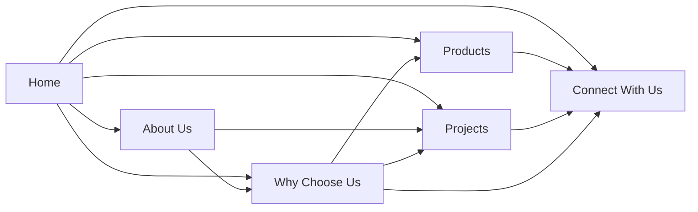

# Rachana Aluminium — Page Architecture Document

> **Source of truth:** PROJECT_CONTEXT.md · IMPLEMENTATION_NOTES.md · SITEMAP.md · Approved client corrections
>
> **Guiding principle:** Show first. Explain second.
>
> This document defines page-level architecture and content strategy for all 6 main pages.
> No UI. No wireframes. No code. Structure and content logic only.

---
---

# 1. HOME

## 1.1 Page Purpose

The home page is the brand's front door. It must communicate — within seconds — that Rachana Aluminium is a professional, trustworthy, and quality-driven company. It provides a complete overview of who the company is, what they offer, and why they can be trusted, all in a single scroll journey.

The page should leave visitors with a clear emotional impression:
*"This company is professional. They care about quality. I can trust them."*

## 1.2 Target Audience

| Priority | Segment | Arrival Context |
|---|---|---|
| **Primary** | Builders, Architects, Engineers, Contractors | Evaluating the company for a project partnership |
| **Secondary** | Homeowners (middle-class and premium) | Exploring window and door options for their home |

## 1.3 User Goals

- Immediately understand what this company does
- Assess professionalism and credibility within the first few seconds
- See the range of products available
- View real completed projects as proof of capability
- Understand the company's working philosophy
- Find a clear, comfortable way to reach out

## 1.4 Business Goals

- Create a strong, lasting first impression
- Establish trust before the visitor reads a single paragraph
- Communicate brand values through visuals and structure, not through text claims
- Guide visitors naturally toward Products, Projects, or Connect With Us
- Represent the owner's personality: calm, professional, human

## 1.5 Required Sections

### Section 1 — Hero
- A single powerful visual from a real completed project
- Short headline: calm, confident, brand-defining (not a sales pitch)
- One supporting line that positions the company
- One soft navigation link (e.g., "Explore Our Work")
- No aggressive CTA. No "Get Quote." No "Call Now."

### Section 2 — Trust Indicators
- Compact visual display of key credibility facts
- Data points:
  - Established 2012
  - 25+ years of owner experience
  - 500+ completed projects
  - Multi-state presence
  - 50–70 team members
- Format: Icons or small visual elements — no paragraphs

### Section 3 — Our Philosophy
- A short, honest statement about how the company approaches work
- Central message: *"We treat every project as if we were building it for ourselves."*
- 2–3 lines maximum. Visually distinct. Human tone.

### Section 4 — Our Process
- Simplified visual walkthrough of the project lifecycle:
  1. Consultation & Understanding Requirements
  2. Customization & Design Guidance
  3. In-House Manufacturing
  4. Quality Checks
  5. Installation
  6. After-Sales Support
- Format: Linear visual flow — icons with short labels, not paragraphs

### Section 5 — Featured Products
- Visual cards for all 6 product categories:
  - System Windows
  - Casement Windows
  - Sliding Folding Windows & Doors
  - Pleated Mesh
  - Sliding Doors
  - uPVC Solutions
- Each card: Real product image + product name + one-line description + link
- Show the product, then name it. Visual first.

### Section 6 — Featured Projects
- Curated selection of 3–6 completed projects
- Each item: Project image + project type label + location
- Closing link: "View All Projects"
- Real photography only. No stock images.

### Section 7 — Why Choose Us (Summary)
- Condensed version — 3 to 4 key differentiators only:
  - ~90% In-House Manufacturing
  - Customization
  - Personal Attention
  - After-Sales Service
- Format: Compact icon grid or small cards
- Closing link: "Learn More" → Why Choose Us page

### Section 8 — Connect With Us (Soft Close)
- Warm, inviting closing section
- Language: "We'd love to hear about your project" / "Let's start a conversation"
- One soft link or button to the Connect With Us page
- Ends the page on a human, approachable note

## 1.6 Information Hierarchy

```
1. Hero                    ← Emotional impact — first impression (HIGHEST priority)
2. Trust Indicators        ← Instant credibility proof
3. Our Philosophy          ← Human connection — values
4. Our Process             ← Rational confidence — how we work
5. Featured Products       ← What we offer
6. Featured Projects       ← Proof of delivery
7. Why Choose Us           ← Differentiation summary
8. Connect With Us         ← Warm invitation to act (LOWEST pressure)
```

The hierarchy flows from **emotion** (hero, philosophy) → **logic** (process, products, proof) → **action** (connect). This mirrors how trust is built: feel first, verify second, act third.

## 1.7 Suggested Navigation Flow

```
                    ┌─→ Products Hub
                    │
Hero → Trust → Philosophy → Process → Featured Products ─┤
                                                          └─→ [Individual Product Pages]
                                           │
                                    Featured Projects ──→ Projects Hub
                                           │
                                    Why Choose Us ──→ Why Choose Us Page
                                           │
                                    Connect With Us ──→ Connect With Us Page
```

Every section contains a soft forward path. No dead ends.

## 1.8 Primary Message

*"We are experienced professionals who build aluminium windows and doors with genuine care for quality and relationships."*

This message should be **felt through the page structure**, not stated as a headline.

## 1.9 Trust Signals to Display

| Signal | Placement |
|---|---|
| Established 2012 | Trust Indicators section |
| 25+ years of owner experience | Trust Indicators section |
| 500+ completed projects | Trust Indicators section |
| Multi-state presence | Trust Indicators section |
| ~90% in-house manufacturing | Why Choose Us summary |
| Real project photography | Hero + Featured Projects |
| Brand promise ("We treat every project as if we were building it for ourselves") | Philosophy section |
| After-sales service mention | Why Choose Us summary |

## 1.10 Suggested Calls-to-Action

| CTA | Location | Tone |
|---|---|---|
| "Explore Our Work" | Hero section | Invitational |
| "View All Products" | Featured Products section | Navigational |
| "View All Projects" | Featured Projects section | Navigational |
| "Learn More" | Why Choose Us section | Navigational |
| "Let's Connect" / "Discuss Your Project" | Closing section | Warm, human |

> [!IMPORTANT]
> No CTA should say "Call Now", "Get Quote", or "Book Now". Every action prompt should feel like an invitation, not a demand.

---
---

# 2. PRODUCTS

## 2.1 Page Purpose

A central directory for all product categories. This page helps visitors see the full range of Rachana Aluminium's offerings at a glance and navigate to the specific product category they need.

This is a **wayfinding page** — its job is to orient and direct, not to sell.

## 2.2 Target Audience

| Priority | Segment | Arrival Context |
|---|---|---|
| **Primary** | Architects, Builders | Looking for specific product types to specify for a project |
| **Secondary** | Homeowners | Browsing options, not yet sure what they need |

## 2.3 User Goals

- See the complete range of products at a glance
- Quickly identify and navigate to the product category they need
- Understand the breadth and versatility of offerings
- If unsure, find guidance on which product to explore

## 2.4 Business Goals

- Present the full product range in a professional, organized manner
- Direct traffic efficiently to individual product pages
- Demonstrate that the company offers complete solutions (windows, doors, mesh, uPVC)
- Set the expectation that each product page includes a Selection Guide

## 2.5 Required Sections

### Section 1 — Page Header
- Page title: "Our Products"
- A single introductory line setting context
- Direction: *"From system windows to uPVC solutions — every product is built with precision and care."*
- Keep it short. No long introductions.

### Section 2 — Product Category Grid
- Visual cards for each of the 6 product categories
- Each card:
  - Real product/installation photograph (visual first)
  - Product category name
  - One-line description: what it is (not a sales pitch)
  - Link to the product category page
- Categories displayed:
  1. System Windows
  2. Casement Windows
  3. Sliding Folding Windows & Doors
  4. Pleated Mesh
  5. Sliding Doors
  6. uPVC Solutions
- All cards should feel equally premium. No visual hierarchy that implies one product is more important.

### Section 3 — Selection Guidance Teaser
- A short note letting visitors know that each product page includes a Selection Guide
- Direction: *"Not sure which product suits your needs? Every product page includes a Selection Guide to help you decide."*
- Builds confidence that the company will help them choose, not just sell.

### Section 4 — Soft CTA
- Direction: "Need help choosing? Connect with us."
- Links to Connect With Us page
- Warm, not aggressive

## 2.6 Information Hierarchy

```
1. Page Header          ← Orient the visitor
2. Product Category Grid ← Core content — visual directory (HIGHEST priority)
3. Selection Guidance    ← Reassurance — help is available
4. Soft CTA             ← Path forward if they need help
```

This page is intentionally simple. Its job is to get visitors to the right product page as quickly as possible.

## 2.7 Suggested Navigation Flow

```
Products Hub ──→ System Windows
             ──→ Casement Windows
             ──→ Sliding Folding Windows & Doors
             ──→ Pleated Mesh
             ──→ Sliding Doors
             ──→ uPVC Solutions
             ──→ Connect With Us (if unsure)
```

## 2.8 Primary Message

*"We offer a complete range of aluminium and uPVC solutions — every product built with the same commitment to quality."*

## 2.9 Trust Signals to Display

| Signal | How |
|---|---|
| Real product photography | Every category card uses actual product/installation images |
| Complete solutions range | The breadth itself — 6 categories — signals capability |
| Selection Guide mention | Shows the company helps customers choose, not just sell |
| Consistent quality language | One-line descriptions use calm, quality-focused language |

## 2.10 Suggested Calls-to-Action

| CTA | Location | Tone |
|---|---|---|
| "Explore [Product Name]" | Each product card | Navigational |
| "Need help choosing? Connect with us" | Bottom of page | Supportive, warm |

---
---

# 3. PROJECTS

## 3.1 Page Purpose

The visual portfolio of completed work. This is the **strongest proof-of-capability page** on the entire website. It transforms marketing claims into visual evidence.

When a builder, architect, or homeowner sees 500+ real projects across residential, commercial, hospitality, and government sectors — trust is built instantly.

## 3.2 Target Audience

| Priority | Segment | Arrival Context |
|---|---|---|
| **Primary** | Architects, Builders, Contractors | Evaluating the company's track record and execution quality |
| **Secondary** | Homeowners | Seeking visual inspiration and reassurance |

## 3.3 User Goals

- Browse completed projects by category
- See the quality, scale, and finish of past work
- Find projects similar to their own (by type or region)
- Gain confidence in the company's execution capability
- Get visual inspiration for their own project

## 3.4 Business Goals

- Provide undeniable visual proof of quality and experience
- Showcase range — residential to government projects
- Build trust through real work, not marketing language
- Demonstrate multi-state execution capability
- Let the work speak for itself

## 3.5 Required Sections

### Section 1 — Page Header
- Title: "Our Projects"
- Short intro: *"Over 500 projects completed across multiple states."*
- No long paragraphs. The work speaks for itself.

### Section 2 — Category Filter
- Allow visitors to view projects by type:
  - All Projects (default view)
  - Residential
  - Commercial
  - Hospitality
  - Government & Institutional
- The filter should feel seamless — not like a complex search tool
- Visual categories, not a dropdown

### Section 3 — Project Grid
- Visual grid of project images
- Each project card:
  - Project photograph (primary — large, high quality)
  - Project type label (Residential / Commercial / etc.)
  - Location
  - Brief context if needed (e.g., "120-unit residential complex")
- Real photography only. Every image must be from an actual Rachana Aluminium project.
- **This is the most image-heavy section on the entire website.**

### Section 4 — Soft CTA
- Direction: *"Have a similar project in mind? Let's discuss."*
- Links to Connect With Us
- Warm, relevant

## 3.6 Information Hierarchy

```
1. Page Header         ← Context setting
2. Category Filter     ← Wayfinding — let visitors find relevant projects
3. Project Grid        ← Core content — visual proof (HIGHEST priority)
4. Soft CTA            ← Path forward
```

Visual proof is everything on this page. Minimize text. Maximize imagery.

## 3.7 Suggested Navigation Flow

```
Projects Hub ──→ Filter: Residential
             ──→ Filter: Commercial
             ──→ Filter: Hospitality
             ──→ Filter: Government & Institutional
             ──→ Connect With Us
```

Visitors should be able to switch between categories without page reloads. The experience should feel fluid and continuous.

## 3.8 Primary Message

*"500+ projects. Multiple states. Consistent quality."*

This message is communicated **through the volume and quality of project images**, not through a headline.

## 3.9 Trust Signals to Display

| Signal | How |
|---|---|
| Volume of completed projects | Sheer number of projects in the grid |
| Diversity of project types | 4 distinct categories |
| Geographic spread | Location labels on projects showing multi-state work |
| Quality of execution | High-quality photography showing finished installations |
| Sector credibility | Government & institutional projects signal serious capability |

## 3.10 Suggested Calls-to-Action

| CTA | Location | Tone |
|---|---|---|
| Category filter labels | Top of grid | Navigational |
| "Have a similar project? Let's discuss" | Bottom of page | Warm, conversational |
| "Connect With Us" | Closing section | Invitational |

---
---

# 4. ABOUT US

## 4.1 Page Purpose

The soul of the website. This page tells the human story of Rachana Aluminium — who they are, what they believe in, and why they do what they do.

While every other page communicates competence, this page communicates **character**. It should be the most emotionally resonant page on the site.

## 4.2 Target Audience

| Priority | Segment | Arrival Context |
|---|---|---|
| **All audiences equally** | Builders, Architects, Homeowners | Want to understand the people and values behind the brand |

This page is for anyone who asks: *"Who are these people?"*

## 4.3 User Goals

- Learn the company's story and origin
- Understand the people and values behind the brand
- See the physical infrastructure (workshops, showroom)
- Assess the company's geographic reach and scale
- Feel confident that these are good people to work with

## 4.4 Business Goals

- Build deep trust and emotional connection
- Communicate values through storytelling, not through bullet-point claims
- Show the human side — workers, owner, culture
- Demonstrate scale and infrastructure as credibility markers
- Reflect the owner's personality: calm, humble, people-first

## 4.5 Required Sections

### Section 1 — Our Story
- The company's origin and the owner's journey
- How experience became enterprise
- Key facts woven into narrative: established 2012, 25+ years of personal industry experience, organic growth
- Tone: First-person plural ("We started with…"), honest, humble, warm
- **Not a corporate biography. A human story.**

### Section 2 — Quality Products. Trusted Relationships.
- A bridge between what the company makes and how the company works
- Central idea: Quality and trust are not separate things — they go together
- Direction: *"We believe quality products and trusted relationships go hand in hand."*
- This is not a mission statement. It's a lived truth.

### Section 3 — The People Behind Every Project
- Acknowledgment of the team — the workers, craftsmen, and installers
- The owner considers workers as the backbone of the company. This must be reflected genuinely.
- Direction: *"Our people are our strength. Every window, every door, every project — it's built by hands that care."*
- Could include workshop candid photos, team imagery
- **This section differentiates Rachana Aluminium from faceless competitors.**

### Section 4 — Workshops & Showroom
- Physical infrastructure information with photographs:
  - 1 Workshop in Kabnoor
  - 2 Workshops in Ichalkaranji (main assembly section)
  - Display showroom in Kolhapur
- Shows investment, permanence, and seriousness
- Photos of the actual facilities, not just text descriptions

### Section 5 — Multi-State Presence
- Geographic reach of the company
- Regions: Maharashtra, Goa, Gujarat, North Karnataka, Rajasthan (selected projects)
- Major cities: Kolhapur, Ichalkaranji, Pune, Mumbai, Goa, North Karnataka
- Format: A clean visual representation — map or region listing
- Reinforces: "We're not a local shop. We operate at scale."

### Section 6 — Our Values
- The four brand values, presented simply and visually:
  1. Trust
  2. Quality
  3. Personal Touch
  4. People First
- Not preachy. Not a manifesto. Just clear, visual, honest.
- Short statement under each value — one sentence maximum.

## 4.6 Information Hierarchy

```
1. Our Story                              ← Emotional hook — who we are (HIGHEST)
2. Quality Products. Trusted Relationships ← What we stand for
3. The People Behind Every Project         ← The human heart of the company
4. Workshops & Showroom                    ← Physical proof of investment
5. Multi-State Presence                    ← Scale and reach
6. Our Values                             ← Summary of character
```

The hierarchy flows from **narrative** (story) → **people** (team) → **proof** (infrastructure, reach) → **values** (summary).

## 4.7 Suggested Navigation Flow

```
About Us ──→ Why Choose Us (natural next step — from "who we are" to "why us")
         ──→ Projects (proof of the story being told)
         ──→ Connect With Us (if they're already convinced)
```

## 4.8 Primary Message

*"We are a family of professionals who have spent over two decades building quality products and trusted relationships."*

This message should emerge from the page's storytelling — not be stated as a banner headline.

## 4.9 Trust Signals to Display

| Signal | Placement |
|---|---|
| Owner's 25+ years of experience | Our Story section |
| Established 2012 | Our Story section |
| Workers as the backbone | People Behind Every Project section |
| 3 workshops + 1 showroom | Workshops & Showroom section |
| Multi-state operations | Multi-State Presence section |
| 500+ completed projects | Can be referenced in story context |
| Real facility photographs | Workshops & Showroom section |
| Real team/worker photographs | People section |

## 4.10 Suggested Calls-to-Action

| CTA | Location | Tone |
|---|---|---|
| "See Why Companies Choose Us" | After Our Values | Navigational, to Why Choose Us page |
| "View Our Work" | After Our Story or People section | Navigational, to Projects page |
| "Let's Connect" | Page closing | Warm, invitational |

> [!NOTE]
> This page should have the **fewest CTAs** of any page. The story itself is the conversion tool. Don't interrupt it with buttons.

---
---

# 5. WHY CHOOSE US

## 5.1 Page Purpose

A focused, factual page that articulates the company's competitive advantages. While About Us builds emotional connection through narrative, Why Choose Us provides **rational reasons** to trust and choose Rachana Aluminium.

This is the page that answers: *"Why should I work with you instead of someone else?"*

## 5.2 Target Audience

| Priority | Segment | Arrival Context |
|---|---|---|
| **Primary** | Builders, Architects, Contractors | Making a vendor decision — comparing options |
| **Secondary** | Homeowners | Validating their inclination to work with the company |

## 5.3 User Goals

- Understand specifically what makes Rachana Aluminium different
- Get concrete, verifiable reasons to choose this company
- Compare differentiators against their decision-making criteria
- Feel confident enough to take the next step (connect)

## 5.4 Business Goals

- Clearly articulate differentiators in a structured, scannable format
- Address the most common decision-making criteria for the target audience
- Convert consideration into connection (drive toward Connect With Us)
- Reinforce trust without using aggressive persuasion language

## 5.5 Required Sections

### Section 1 — Page Header
- Title: "Why Choose Us"
- A single introductory line — calm, factual, not boastful
- Direction: *"Here's what makes us different."* or *"Built on quality. Sustained by trust."*

### Section 2 — In-House Manufacturing
- ~90% of manufacturing is handled internally
- Processes: Precision cutting, fabrication, assembly, packaging, quality checks
- Why it matters: Direct control over quality, consistency, and timelines
- Powder coating and certain on-site installation are handled by trusted external partners
- **This is the single strongest differentiator. Give it the most visual weight.**

### Section 3 — Customization
- Every product can be customized:
  - Colours
  - Glass types
  - Handles
  - Locks
  - Mesh options
- The company also provides expert recommendations
- Message: "Your project, your choices — with our guidance."

### Section 4 — Quality at its Best
- The company's commitment to quality — in materials, processes, and finished work
- Not just a claim. Reference the real processes: material selection, in-house QC, assembly precision
- Ties to the tagline: *"Quality at its Best"*

### Section 5 — Experienced Team
- 25+ years of owner experience
- 50–70 skilled team members
- 500+ completed projects
- Numbers presented as evidence, not as boasting
- Direction: *"Experience you can rely on."*

### Section 6 — Personal Attention
- Every project gets individual attention
- The company's philosophy: *"We treat every project as if we were building it for ourselves."*
- This is what separates them from large, impersonal competitors

### Section 7 — After-Sales Service
- The relationship doesn't end at installation
- Ongoing support, maintenance, long-term commitment
- Direction: *"We stay with you long after the project is done."*

### Section 8 — Soft CTA
- Direction: *"Ready to start your project? Let's connect."*
- Warm, not pushy. The facts should have done the persuading.

## 5.6 Information Hierarchy

```
1. Page Header              ← Framing
2. In-House Manufacturing   ← #1 differentiator (HIGHEST priority)
3. Customization            ← Flexibility and choice
4. Quality at its Best      ← Core commitment
5. Experienced Team         ← Credibility through numbers
6. Personal Attention       ← Human touch
7. After-Sales Service      ← Long-term reliability
8. Soft CTA                 ← Path to action
```

The hierarchy moves from the **most tangible, verifiable differentiator** (in-house manufacturing) to the **most relationship-driven** (personal attention, after-sales). Fact first, feeling second.

## 5.7 Suggested Navigation Flow

```
Why Choose Us ──→ Connect With Us (primary next step)
              ──→ Products (explore what we make)
              ──→ Projects (see proof of all these claims)
```

## 5.8 Primary Message

*"We manufacture most of our products in-house, customize everything to your needs, and treat every project as if it were our own."*

## 5.9 Trust Signals to Display

| Signal | Placement |
|---|---|
| ~90% in-house manufacturing | Section 2 — with process details |
| 25+ years of experience | Section 5 |
| 500+ projects | Section 5 |
| 50–70 team members | Section 5 |
| Customization with expert guidance | Section 3 |
| After-sales commitment | Section 7 |
| Brand promise quote | Section 6 |

## 5.10 Suggested Calls-to-Action

| CTA | Location | Tone |
|---|---|---|
| "Explore Our Products" | After Customization section | Navigational |
| "View Our Projects" | After Experienced Team section | Navigational |
| "Let's Connect" / "Discuss Your Project" | Page closing | Warm, invitational |

---
---

# 6. CONNECT WITH US

## 6.1 Page Purpose

The contact and inquiry page. Its job is to make reaching out feel **easy, warm, and pressure-free**. This is NOT a hard-sell conversion page. It's an open door.

The visitor has already built trust through other pages. This page simply says: *"We're here. Let's talk."*

## 6.2 Target Audience

| Priority | Segment | Arrival Context |
|---|---|---|
| **All audiences** | Builders, Architects, Homeowners, Contractors | Ready to initiate a conversation or learn how to reach the company |

## 6.3 User Goals

- Find contact information quickly (phone, email)
- Submit a project inquiry without friction
- Learn about the showroom (location, what to expect)
- Request a free site visit and measurement
- Feel welcomed, not interrogated

## 6.4 Business Goals

- Capture genuine, qualified inquiries
- Provide multiple comfortable contact channels
- Encourage showroom visits (converts browsers into serious leads)
- Offer free site visits as a low-friction entry point
- Keep the entire experience warm and non-transactional

## 6.5 Required Sections

### Section 1 — Introduction
- A short, warm welcome — 1 to 2 lines maximum
- Direction: *"We'd love to hear about your project."* or *"Let's start a conversation."*
- Tone: Inviting. Not transactional. Not "Fill out this form to get a quote."

### Section 2 — Contact Information
- Direct contact details, prominently displayed:
  - Phone number(s) — tappable on mobile
  - Email address
  - Working hours (if applicable)
- Format: Clean, scannable, easy to find
- **This should be visible without scrolling.** Some visitors just want a phone number.

### Section 3 — Inquiry Form
- A simple, short form for project inquiries
- Fields:
  - Name (required)
  - Phone number (required)
  - Email (optional)
  - Project type — dropdown: Residential / Commercial / Hospitality / Government & Institutional / Other
  - City or Location
  - Message (open text, optional)
- **Keep it short.** Do not ask for budget, timeline, square footage, or other details that create friction.
- Submit button label: "Send Inquiry" or "Let's Connect" (not "Get Quote" or "Submit")

### Section 4 — Showroom Information
- Kolhapur showroom details:
  - Full address
  - Visiting hours (if applicable)
  - What visitors can expect at the showroom (see products in person, discuss requirements)
- CTA direction: "Plan Your Visit"

### Section 5 — Workshop Information
- Brief mention of workshop locations:
  - 1 workshop in Kabnoor
  - 2 workshops in Ichalkaranji (including main assembly)
- Purpose: Reinforces the in-house manufacturing trust signal
- Not a detailed section — just enough to show physical presence and seriousness

### Section 6 — Free Site Visit & Measurement
- Information about the company's site visit and measurement service
- Direction: *"We offer free site visits and measurements to help you plan your project."*
- CTA: "Request a Site Visit" or "Schedule a Visit"
- This lowers the barrier to engagement — it's free, it's helpful, it's non-committal

## 6.6 Information Hierarchy

```
1. Introduction          ← Warm welcome
2. Contact Information   ← Immediate utility (HIGHEST priority for quick visitors)
3. Inquiry Form          ← Primary conversion path (HIGHEST priority for engaged visitors)
4. Showroom Information  ← Physical touchpoint — encourages visits
5. Workshop Information  ← Trust reinforcement
6. Free Site Visit       ← Low-friction entry point
```

Two visitor types arrive here:
- **Quick visitors** — they just want a phone number → Contact Info is first
- **Engaged visitors** — they want to describe their project → Form is immediately after

## 6.7 Suggested Navigation Flow

```
Connect With Us ──→ Phone call (direct)
                ──→ Email (direct)
                ──→ Form submission
                ──→ Showroom visit (planned)
                ──→ Site visit request
```

This is a **terminus page**. Most visitors end their website journey here by taking action. The page should not redirect them elsewhere — it should facilitate contact.

## 6.8 Primary Message

*"We're here. We'd love to hear about your project. Reach out however you're most comfortable."*

## 6.9 Trust Signals to Display

| Signal | Placement |
|---|---|
| Direct phone number (transparency) | Contact Information — top of page |
| Physical showroom address | Showroom section |
| Multiple workshop locations | Workshop section |
| Free site visit offer | Site Visit section |
| Warm, human language throughout | Every section |
| No-pressure form (short, simple) | Form itself signals respect for the visitor's time |

## 6.10 Suggested Calls-to-Action

| CTA | Location | Tone |
|---|---|---|
| Phone number (clickable) | Contact Information | Direct, utility |
| Email address (clickable) | Contact Information | Direct, utility |
| "Send Inquiry" / "Let's Connect" | Form submit button | Warm |
| "Plan Your Visit" | Showroom section | Invitational |
| "Request a Site Visit" | Site Visit section | Helpful, low-pressure |

> [!IMPORTANT]
> This page should have **zero** aggressive language. No "Limited time offer." No "Get your free quote today." No urgency tactics. The entire page should feel like a conversation starter, not a sales funnel.

---
---

# CROSS-PAGE ARCHITECTURE SUMMARY

## Navigation Structure

```
[Logo → Home]   Home   Products ▾   Projects ▾   About Us   Why Choose Us   Connect With Us
```

## Page Relationships



## Visitor Journey Patterns

| Visitor Type | Likely Path |
|---|---|
| **Architect evaluating vendor** | Home → Projects → Why Choose Us → Connect |
| **Builder checking capability** | Home → Products → Projects → Connect |
| **Homeowner exploring options** | Home → Products → [Product Page] → Connect |
| **Referral visitor (already trusts)** | Home → Products → Connect |
| **First-time curious visitor** | Home → About Us → Why Choose Us → Connect |

## Global Content Principles

| Principle | Applied How |
|---|---|
| Show first, explain second | Every section leads with visuals, follows with text |
| Calm, confident voice | Short sentences. Honest language. No buzzwords. |
| Warm CTAs only | "Connect With Us", "Discuss Your Project", "Plan Your Visit" |
| Real photography only | No stock images anywhere on the site |
| White space is a feature | Every page breathes. No information overload. |
| Educate, don't sell | Selection Guides, process visualization, honest product descriptions |
| Every page has a soft path to Connect | No dead ends. No hard sells. Just clear, warm paths forward. |

---

*Phase 2 — Page Architecture complete. Ready for Phase 3 on your approval.*
